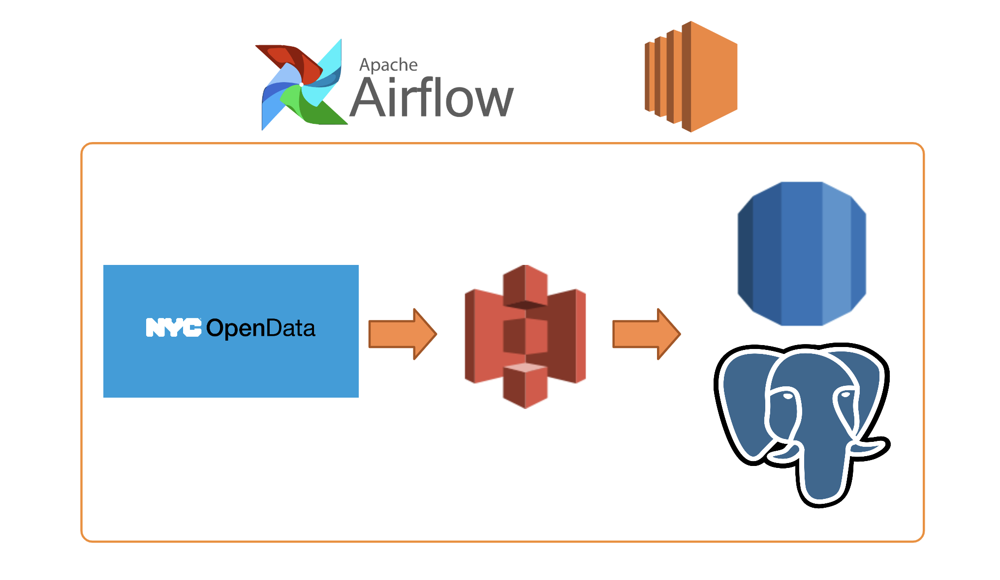
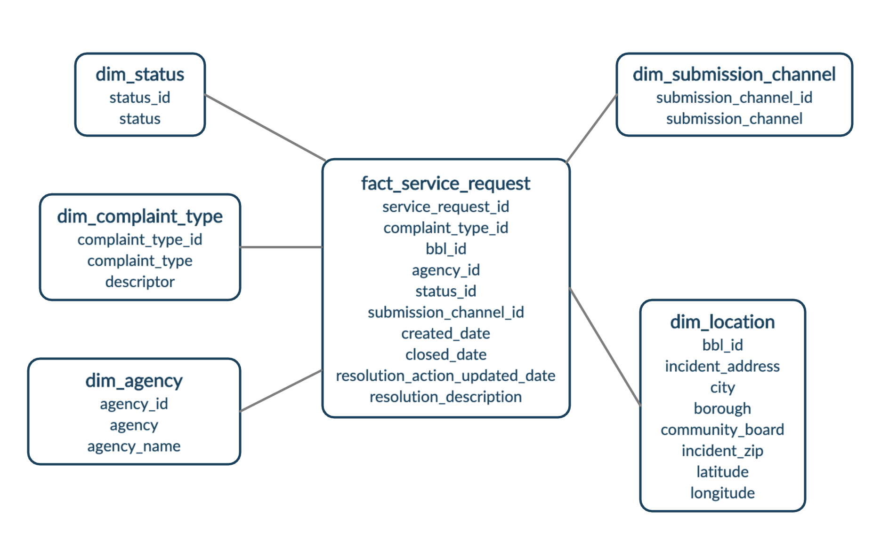
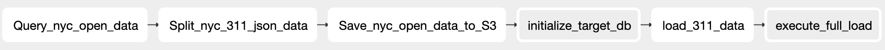
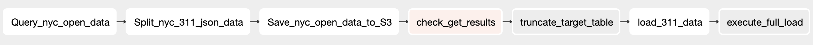

# NYC 311 Data Pipeline

311's mission is to provide the people of New York with access to all of the city's government services and information through the form of service requests. There are a number of different municipal services that are offered, intended to manage the upkeep of streets, buildings, and citizens. This pipeline is orchestrated with Apache Airflow and housed within the AWS ecosystem.

<h3>Architecture:</h3>

The data is sourced from New York City's 311 service request data, via their Open Data API. Airflow orchestrates its movement to an S3 bucket and into a data warehouse hosted in RDS. SQL scripts are then ran to transform the data from its raw form through a staging schema before finally being placed into production tables. An EC2 instance is used as a dedicated resource for Airflow, managed by AWS Instance Scheduler to complete the daily DAG run and shut off after execution.

<h3>Data Model:</h3>

The data warehouse is structured as a star schema, consisting of a fact table for all of the 311 service requests, with associated dimensions.

Fact table
- fact_service_request: 311 service requests for NYC

Dimension tables
- dim_agency: Government agency/department that the request was assigned to
- dim_complaint_type: Type of service requested
- dim_location: Where the service was requested
- dim_status: Current state of the request (assigned, closed, etc.)
- dim_submission_channel: How the service was requested (phone, online, etc.)

<h3>ETL Overview:</h3>
311 Requests are collected from the SODA API and migrated into an S3 bucket
- Once migration is complete, data is moved into a raw schema in RDS and subsequentially moves through staging schema for processing
- Upon completion of processing, data is moved into the final production tables

There are two DAGs used for this pipeline. <b>full load</b>, which is executed upon initial set up and <b>incremental load</b> which is scheduled to run daily and pull new data from the Scorata Open Data API.

The incremental load DAG uses XCom to pass the filesize of the load between the API call task and a ShortCircuitOperator to skip downstream tasks if the API call produces no results.

<h3>Future Improvements/Implementation Opportunities:</h3>

A few additional resources that can be implemented into the pipeline/architecture are...
- A number of additional data sources that could prove to be useful (demographic or weather info)
- A BI/Data Viz component for proper analysis. Metabase could be a good open source option here
